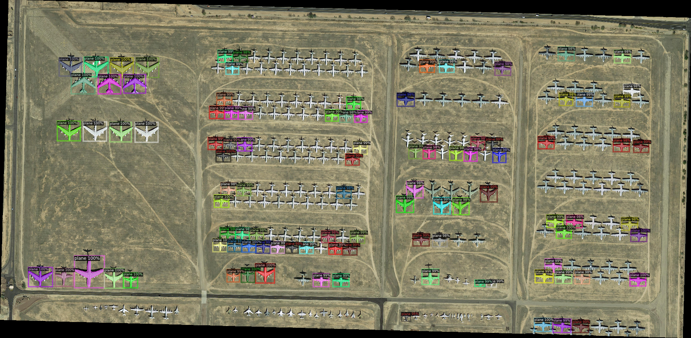
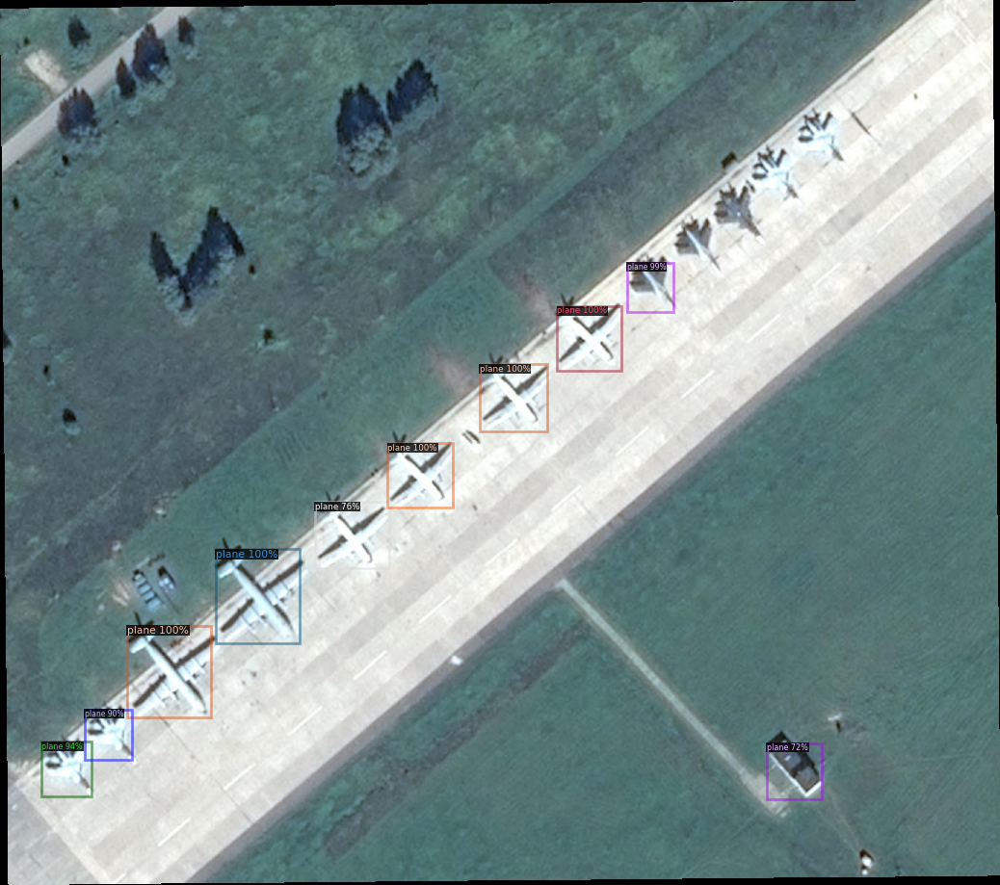
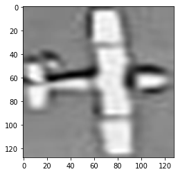

# Aircraft Detection and Instance Segmentation in Aerial Images

Computer vision project for detecting aircraft in high-resolution aerial imagery, segmenting each detected aircraft, and exporting instance masks in run-length encoding (RLE) format for evaluation/submission.



## Why This Project Matters

Aerial aircraft detection is a small-object vision problem: targets are tiny relative to the full image, object scales vary, and crowded scenes require instance-level separation rather than only image classification. This project turns raw aerial images and polygon annotations into a full detection/segmentation pipeline.

## Project Highlights

- Built a Detectron2 data pipeline that converts aircraft annotations into COCO-style records with bounding boxes, polygon masks, image metadata, and train/test registration.
- Fine-tuned Faster R-CNN for aircraft detection using COCO-pretrained backbones.
- Built a custom U-Net-style semantic segmentation model in PyTorch for cropped aircraft masks.
- Combined detector outputs with the segmentation model to generate image-level instance masks.
- Implemented RLE mask export for Kaggle-style instance segmentation submission.
- Compared a two-stage custom pipeline against Mask R-CNN as an end-to-end baseline.

## Results

| Task | Model | Metric | Result |
| --- | --- | --- | --- |
| Object detection | Faster R-CNN X-101-FPN | COCO bbox AP | 44.93 |
| Object detection | Faster R-CNN X-101-FPN | COCO bbox AP50 | 67.20 |
| Crop-level semantic segmentation | Custom U-Net-style CNN | Mean IoU | 0.872 |
| Instance segmentation | Mask R-CNN R-50-FPN | COCO segm AP | 15.16 |
| Instance segmentation | Mask R-CNN R-50-FPN | COCO segm AP50 | 41.56 |

The strongest crop-level segmentation result came from the custom PyTorch model, while Mask R-CNN provided a cleaner end-to-end instance segmentation baseline.

## Method

### 1. Detection Data Pipeline

The notebook parses `train.json`, groups aircraft annotations by image, loads image size metadata, and registers the dataset with Detectron2's `DatasetCatalog` and `MetadataCatalog`.

Expected local data layout:

```text
data/
  train/
    *.png
  test/
    *.png
  train.json
```

### 2. Aircraft Detection

Faster R-CNN was fine-tuned from COCO-pretrained weights:

- Backbone/config: `faster_rcnn_X_101_32x8d_FPN_3x`
- Classes: `1` aircraft class
- Batch size: `2`
- Learning rate: `0.0005`
- Iterations: `5000`



### 3. Crop-Level Segmentation

Each aircraft annotation is cropped from the full aerial image using its bounding box, resized to `128 x 128`, and paired with a binary mask generated from polygon annotations.

The custom segmentation model uses an encoder-decoder CNN with skip-style additive connections:

- Input: `3 x 128 x 128` aircraft crop
- Output: `1 x 128 x 128` binary mask logits
- Loss: `BCEWithLogitsLoss`
- Optimizer: SGD
- Epochs: `50`
- Final crop-level IoU: `0.872`



### 4. Instance Mask Reconstruction

For inference, the detector first proposes aircraft bounding boxes. The segmentation model then predicts a mask for each crop, resizes it back to the original bounding-box dimensions, and pastes each instance into the full-resolution canvas with a unique instance id.

### 5. RLE Export

Final instance masks are converted into run-length encoding using a GPU tensor implementation, producing a CSV-compatible format:

```text
ImageId,EncodedPixels
```

## Repository Structure

```text
.
|-- README.md
|-- requirements.txt
|-- lab3_final.ipynb              # Full experiment notebook with outputs
|-- 301416917/lab3.ipynb          # Submitted notebook copy
|-- 301416917.pdf                 # Original project report
|-- assets/                       # Extracted visual results for portfolio review
`-- docs/
    |-- interview-guide.md        # Chinese interview pitch and talking points
    `-- project-card.md           # Concise technical project summary
```

## How to Reproduce

This project was originally developed in Google Colab with GPU acceleration.

1. Install dependencies from `requirements.txt`.
2. Install Detectron2 for your CUDA/PyTorch version using the official Detectron2 installation guide.
3. Place the dataset under `data/train`, `data/test`, and `data/train.json`.
4. Open `lab3_final.ipynb`.
5. Set `BASE_DIR` to the project directory.
6. Run the notebook sections in order:
   - data registration
   - Faster R-CNN training/evaluation
   - crop segmentation training/evaluation
   - instance mask reconstruction
   - Mask R-CNN comparison

## Interview Summary

I built an aerial aircraft detection and segmentation pipeline using Detectron2 and PyTorch. The main challenge was that aircraft are small relative to the aerial images, so I decomposed the task into detection, crop-level segmentation, and full-image instance reconstruction. I fine-tuned Faster R-CNN for localization, trained a custom U-Net-style model for aircraft masks, and exported predictions as RLE instance masks. The custom crop segmentation reached about `0.872` IoU, and the Detectron2 detector reached `44.93` COCO bbox AP / `67.20` AP50.

See [docs/interview-guide.md](docs/interview-guide.md) for a polished Chinese interview script and resume bullets.
